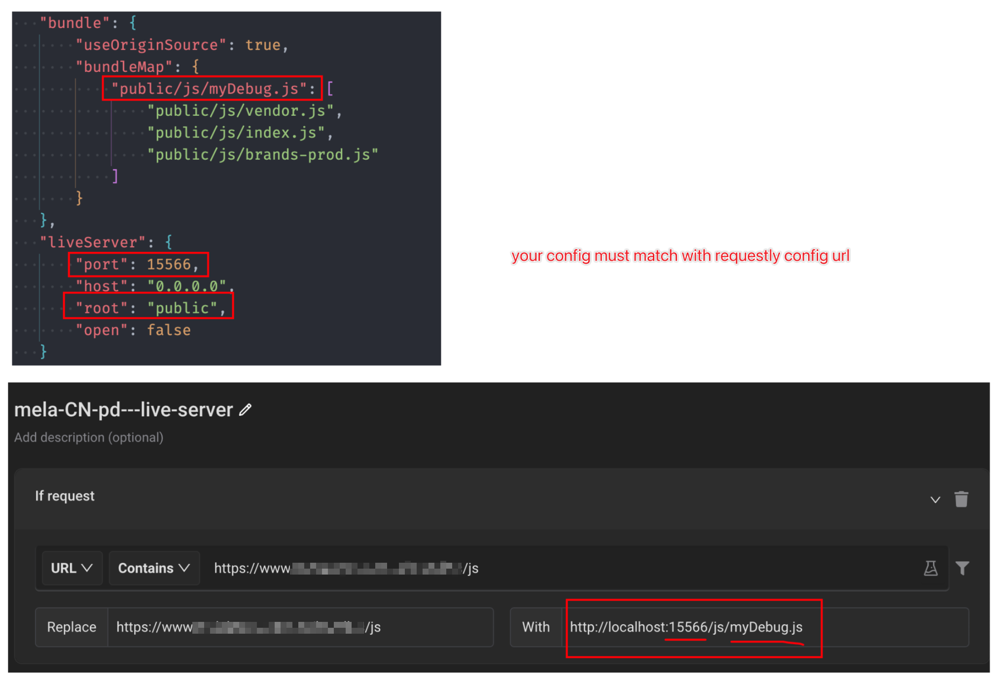
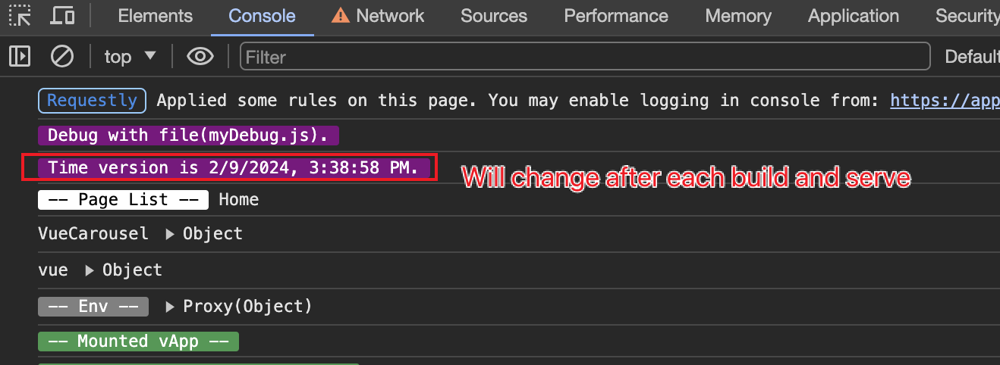
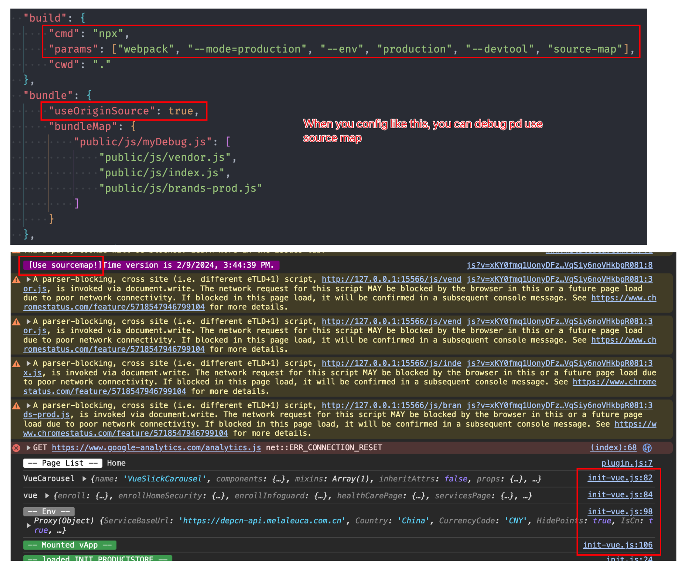

# This script helps do build your project and server your static files.

## Features
- Simple and fast configuration
- Environment pre-check
- Auto bundle files
- Monitor changes to your project's code and automate task execution(re-build and re-serve) by `nodemon`
- Serve your generated static files by `live-server`

## Usage
#### How to run this script (below is two ways)
1. Use source code
    - Download this repo
    - Just run `npm run abas` under this repo

2. Or install commond line script
    - npm i -g mela-utility
    - and then run `abas` under your terminal

#### How to use
1. Open your terminal, and run `abas`
> When you first time use this commond-line tool, the script will generate a initial config file `~/.mela/abas.config.json`, then you need to repleace with your own env configurations(This only need to config one time each project)(**Usually you just only need to change the `projectPath` field to your own**). Here is [config template](./template.abas.config.json). **After you setup your config file, run `abas` again**.

> Please note that when you configure `build.cmd` variables, `the windows environment and the unix* environment may be different`. For example, the unix* environment may use `npm` and `npx`, while the windows environment uses `npm.cmd` and `npx.cmd`.

2. Set you chrome plugin`requestly` config match with your config file, as below:

3. Then you can visit your website and refresh.

## Configuration
| Item                      | Required | Type     | Description |
| :------------------------ |  :-----: | :------: | :-------------------------------------------------- |
| projectPath               | true     | string   | Your project path(must be an absolute path)         |
| nodeMajorVersionExpect    | false    | string   | Node version expected(only check `major` version)   |
| nodemon                   | false    | object   | The path to monitor                                 |
| nodemon.ext               | false    | string   |                                                     |
| nodemon.watch             | false    | string[] | Paths to watch (relative path or absolute path)     |
| nodemon.ignore            | false    | string[] | Paths to ignore (relative path or absolute path)    |
| build                     | true     | object   |                                                     |
| build.cmd                 | true     | string   |                                                     |
| build.params              | true     | string[] |                                                     |
| build.cwd                 | true     | string   | Build directory (relative path or absolute path)    |
| bundle                    | false    | boolean  | Bundle options                                      |
| bundle.useOriginSource    | false    | boolean  | Bundle options                                      |
| bundle.bundleMap          | fasle    | object   | Files need bundle (relative path or absolute path)  |
| liveServer                | true     | object   |                                                     |
| liveServer.port           | true     | number   |                                                     |
| liveServer.host           | true     | string   |                                                     |
| liveServer.root           | true     | string   | Directory to serve (relative path or absolute path) |
| liveServer.open           | true     | boolean  |                                                     |

## useful
#### Will console.log new version string(timestamp) after each build and serve

#### debug with source map

